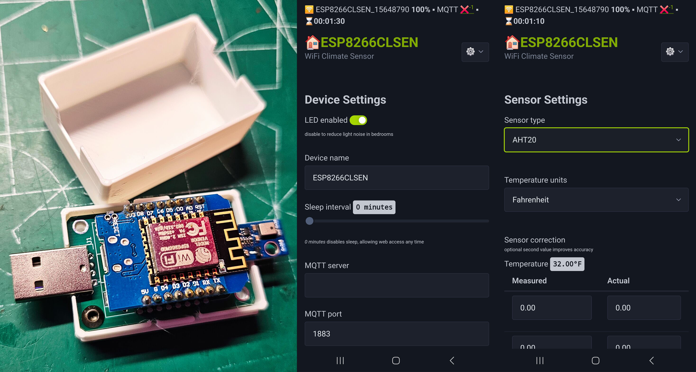
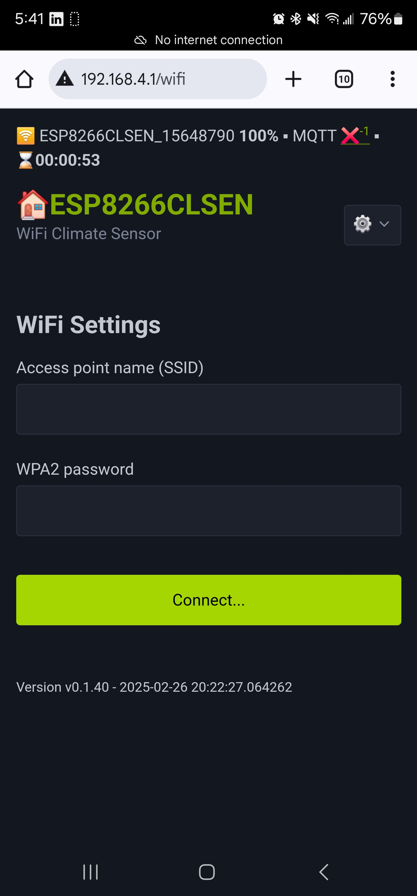
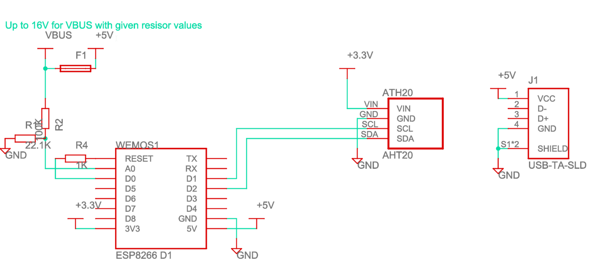
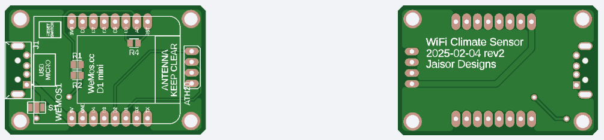
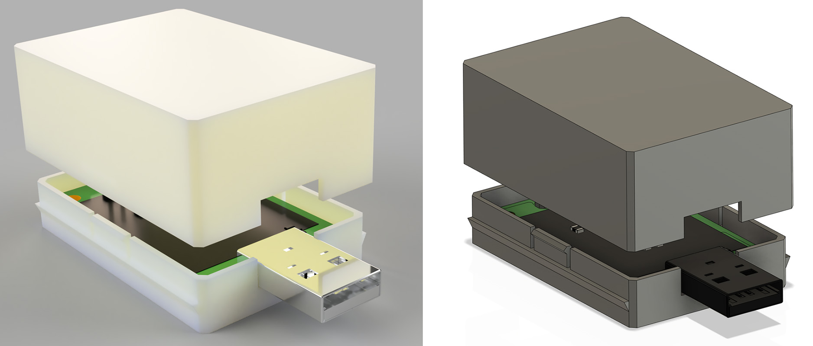

# WiFi Climate Sensor



Supported features:
* ESP8266, ESP32, ESP32-C3 or ESP32-S3 based
* Built-in web server with UI for sensor reading and configuration
* Selectable temperature/humidity sensor: AHT20, BME280, BME688, DHT22, DS18B20
* BME688 adds barometric pressure, gas resistance and an estimated Indoor Air Quality index
* I2C autodetection of the AHT20, BME280 and BME688, selected and saved automatically on boot
* Optional INA219 I2C power monitor for bus voltage and current, auto-detected at boot
* MQTT support for transmitting sensor data
* Home Assistant MQTT auto-discovery for temperature, humidity, pressure, gas resistance, air quality, voltage, current and power sensors
* OTA firmware update using ElegantOTA at `/update`
* OTA firmware update triggered via MQTT config topic
* 3D printed case for clean and seamless mounting

# Usage

## Initial boot / reset

Compile for your select ESP architecture and flash over USB.

On first boot the device creates a self-hosted WiFi access point (AP) with SSID starting with `ESP8266CLSEN` or `ESP32CLSEN` and WPA2 password `password123`
In self-hosted AP mode, the device gives itself `192.168.4.1` IP address.

The device can be connected to an existing AP using the `/wifi` option



## Resetting / erasing configuration

The device will reset itself to default configuration and self-hosted AP if unable to complete its boot sequence within 2 seconds (smooth boot) 3 times in a row.
This can be forced by power-cycling the device several times. Powered up durations should be about 1 second (less than 2 second, but enough for the CPU to start). 

# Climate sensor autodetection

On boot the I2C bus is probed for the two climate sensors that live on it, and the first match is selected and
persisted to EEPROM, so a freshly flashed board generally needs no sensor configuration at all:

| Sensor | Addresses probed | Chip id at `0xD0` |
|---|---|---|
| BME280 | `0x76`, then `0x77` | `0x60` |
| BME688 | `0x76`, then `0x77` | `0x61` |
| AHT20 | `0x38` | - |

The BME280 and BME688 share the same two addresses, so an address probe alone cannot tell them apart. The chip id
register `0xD0` is read to decide, and anything else there (a BMP280 reports `0x58`) is logged and skipped rather
than misreported. Whichever address answered is remembered, so a sensor strapped to `0x77` is opened on `0x77`.

The BME680 and BME688 both report chip id `0x61` and use the same driver. The variant register `0xF0` separates
them (`0x01` is the BME688) and only affects the name shown in the UI and published over MQTT.

Autodetection only overrides the stored setting when nothing is configured yet, or when the configured sensor is
itself an I2C one that no longer answers - swapping a BME280 for an AHT20 is picked up on the next boot. An explicit
DS18B20 or DHT22 selection is never overridden, since neither is on the I2C bus. Set `TEMP_SENSOR_AUTODETECT` in
[Configuration.h](src/Configuration.h) to turn the whole thing off and go back to choosing the sensor by hand.

Note that on the ESP32-C3 the DS18B20 data pin and `SCL` are the same GPIO. When a DS18B20 is selected the I2C bus
is never started, so neither autodetection nor the INA219 runs on that target.

# BME688 air quality

The BME688 is wired to the same I2C pins as the AHT20 and BME280 and reports four values: temperature, humidity,
barometric pressure and gas resistance. All four appear on the main page and in the MQTT payload; pressure is also
reported by the BME280.

Gas resistance is published raw in ohms as `gas_resistance_ohms` and shown in kilohms on the web page. Higher
resistance means cleaner air.

## Indoor Air Quality index

The raw resistance is also run through an IAQ estimator in [AirQuality.cpp](src/AirQuality.cpp), which reports on the
same 0-500 scale BSEC uses (lower is cleaner):

| IAQ | Rating |
|---|---|
| 0-50 | Excellent |
| 51-100 | Good |
| 101-150 | Lightly polluted |
| 151-200 | Moderately polluted |
| 201-250 | Heavily polluted |
| 251-350 | Severely polluted |
| 351-500 | Extremely polluted |

**This is not Bosch BSEC.** BSEC is a closed-source binary with its own licence and its output cannot be reproduced
from the public datasheet. This estimator has the same shape and reports the same quantity on the same scale, but the
values are not interchangeable with BSEC's. Three steps:

1. **Humidity and temperature compensation.** Gas resistance falls as water vapour rises, independently of air
   quality. Temperature and relative humidity are converted to absolute humidity in g/m3 via the Magnus formula, and
   the reading is lifted back out with `gas * exp(0.03 * absolute_humidity)`. Using absolute rather than relative
   humidity is what makes the correction hold across different temperatures.
2. **Baseline tracking.** The compensated value feeds a clean-air reference that rises towards cleaner readings with
   a 5 minute time constant but decays towards dirtier ones over a day. The asymmetry is the point: a fast decay
   would quietly adopt a persistently polluted room as the new "clean" reference. Adaptation is driven by elapsed
   time rather than sample count, so the read interval does not change the tuning.
3. **Scoring.** 75% of the score is how close the compensated reading sits to the baseline, 25% is how close humidity
   is to an ideal 40%RH. The combined 0-100 score is inverted onto the 0-500 IAQ scale.

The main page shows all of this in one **Gas & Air Quality** panel: the index and its rating, the raw resistance, the
humidity-compensated value with the absolute humidity used to correct it, the current clean-air baseline, and how long
the estimator has been tracking. Below that is a sparkline of the index and the baseline over the last 12 hours, one
point every 15 minutes. That history is kept in RAM only and restarts on reboot - unlike the baseline itself, which is
persisted; a buffer that size written at that cadence would wear the flash for little benefit. A device that deep
sleeps will collect points slowly, one per wake at most.

`iaq_accuracy` mirrors BSEC's field of the same name and says how far the baseline has settled: `0` stabilizing
(the first 5 minutes are discarded while the heater drifts), `1` uncertain, `2` calibrating after 10 minutes, `3`
calibrated after 30. Treat the index as meaningless until it reads at least `2`.

### Surviving restarts and deep sleep

The baseline and the total tracked time are persisted in the configuration, so a restart or a deep sleep cycle
continues the same calibration instead of starting from nothing. Three things make that work:

- **Elapsed time is credited on wake.** The baseline decays on elapsed time, and a sleeping device is only awake for
  a few seconds per cycle, so without this its day-scale decay would take months of real time. On wake the configured
  `deepSleepDurationSec` is added to the next reading's time delta. Over a simulated 24h of sustained pollution a
  device sleeping on a 5 minute interval lands on IAQ 249 against 251 for an always-on one; uncredited it would
  report 316 and barely move its baseline.
- **A resumed session skips the burn-in.** The 5 minute burn-in exists for the heater's initial drift on a cold
  start. A resumed session already has a trusted baseline, so it only discards the first couple of seconds - a
  sleeping device is rarely awake long enough for more.
- **Writes are rate limited.** The baseline is saved at most every 30 minutes and only once it has moved more than
  2% (`IAQ_PERSIST_INTERVAL_MS` and `IAQ_PERSIST_DELTA`), plus once unconditionally just before entering deep sleep.
  Saving on every reading would wear the flash for no benefit.

The persisted fields are appended to `configuration_t` *after* the `_loaded` sentinel on purpose. The sentinel keeps
its offset, so this firmware still accepts configuration written by a build that predates the IAQ block rather than
treating it as blank and resetting your settings; the appended bytes then read back as erased flash, which the
`iaqMagic` marker catches so only the IAQ state is reinitialized.

Two limits remain. Time spent fully powered off is not measured - only the configured sleep interval is credited, so
a device off for a week resumes as though it slept one interval. And an index built on a self-calibrating baseline is
relative to that sensor's own history; compare a device against itself over time, not against another unit.

The heater runs at `BME688_GAS_HEATER_TEMP_C` for `BME688_GAS_HEATER_MS` (320C for 150ms by default, both in
[Configuration.h](src/Configuration.h)). Because that makes a measurement take a few hundred milliseconds, readings
are taken asynchronously with `beginReading()`/`endReading()` so the main loop is never blocked waiting on the heater.

# Power monitoring (INA219)

An optional [INA219](https://www.ti.com/product/INA219) high side current/voltage monitor can be wired to the I2C bus.
It is probed at address `0x40` on every boot: when present its readings show up as a **Power** card on the main page
below temperature and humidity, and in the MQTT payload. When absent the card is omitted entirely and the sensor is
skipped with no further effect. The `/sensor` page splits its settings into an **Environment Sensor** area and a
**Power Sensor** area, each showing the detected sensor name and its pin or I2C address.

These readings are independent of the `voltage_v` value, which is still sampled through the ADC voltage divider.
The INA219 reports the voltage across its own shunt, so the two can be wired to different rails.

| Board | SDA | SCL |
|---|---|---|
| ESP32-C3 | `GPIO7` | `GPIO6` |
| ESP32-S3 | `GPIO8` | `GPIO9` |
| ESP32 / ESP8266 | core default | core default |

Pins are set by `I2C_SDA_PIN` / `I2C_SCL_PIN` in [Configuration.h](src/Configuration.h), and the I2C address by
`INA219_I2C_ID`. The bus is shared with the BME280, AHT20 and OLED peripherals.

# MQTT

## Sensor data

The device publishes a JSON payload to `{mqttTopic}/json` every 5 minutes. Example payload:

```json
{
  "device_id": 12345678,
  "temperature": 21.5,
  "temperature_unit": "Celsius",
  "humidity": 55.2,
  "pressure_hpa": 1013.2,
  "gas_resistance_ohms": 142300,
  "iaq": 32.5,
  "iaq_rating": "Excellent",
  "iaq_accuracy": 3,
  "iaq_accuracy_text": "calibrated",
  "voltage_v": 12.1,
  "ina219_voltage_v": 12.043,
  "ina219_current_ma": 184.2,
  "ina219_power_mw": 2218.3,
  "wifi_rssi": -67,
  "wifi_percent": 66,
  "timestamp_iso8601": "2026-05-28T12:00:00Z",
  "uptime_millis": 300000
}
```

## Home Assistant auto-discovery

On every MQTT publish the device sends Home Assistant MQTT discovery messages, automatically registering the following entities under a single device:

| Entity | Discovery topic |
|---|---|
| Temperature | `homeassistant/sensor/{deviceId}_temperature/config` |
| Humidity | `homeassistant/sensor/{deviceId}_humidity/config` |
| Pressure | `homeassistant/sensor/{deviceId}_pressure/config` |
| Gas resistance | `homeassistant/sensor/{deviceId}_gas_resistance/config` |
| Air quality (IAQ) | `homeassistant/sensor/{deviceId}_iaq/config` |
| Air quality accuracy | `homeassistant/sensor/{deviceId}_iaq_accuracy/config` |
| Voltage | `homeassistant/sensor/{deviceId}_voltage/config` |
| INA219 Voltage | `homeassistant/sensor/{deviceId}_ina219_voltage/config` |
| INA219 Current | `homeassistant/sensor/{deviceId}_ina219_current/config` |
| INA219 Power | `homeassistant/sensor/{deviceId}_ina219_power/config` |

No manual configuration in Home Assistant is required — enable MQTT integration and the device will appear automatically.

## Remote configuration

Publish a JSON payload to `{mqttTopic}/{deviceId}/config` to update configuration at runtime:

```json
{
  "name": "Living Room Sensor",
  "deepSleepDurationSec": 300,
  "ledEnabled": true,
  "tempUnit": 0
}
```

The retained message is deleted immediately after receipt to prevent re-applying on reconnect.

## OTA firmware update over MQTT

Publish a JSON payload to `{mqttTopic}/{deviceId}/config` with a `firmware_location` key to trigger a firmware update:

```json
{ "firmware_location": "http://my-server/firmware_device_.bin" }
```

The substring `_device_` in the URL is replaced with the target architecture before the download:

| Board | Replacement |
|---|---|
| ESP8266 | `ESP8266` |
| ESP32 | `ESP32` |
| ESP32-C3 | `ESP32C3` |
| ESP32-S3 | `ESP32S3` |

So `firmware_device_.bin` becomes e.g. `firmware_ESP32C3_.bin`. The device reboots automatically on a successful update.

The ESP can also be upadted over web OTA at `/update` after the device IP.

# Schematic, PCB and assembly

[Schematic and PCB available online](https://a360.co/4gnvt9p)

[Gerber files uploaded here](https://365.altium.com/files/86EDE8C7-B795-499B-9DB7-9364AABE9626)

[Gedber files direct download](assets/gerber.zip)

[Schematic EAGLE sch file](assets/schematic_eagle.sch)





# Case


STL files:
* [bottom](assets/case_bottom.stl)
* [top](assets/case_top.stl) - if too tight fitting, scale top up by 1%

# Apache proxy setup

Example configuration for exposing a local network device via Apache proxy. Strong advise to use SSL/HTTPS and appropriate authentication and authorization controls to reduce risk of bad actors. 

```
                <Location /ac>
                        AuthType Basic
                        Authname "Password Required"
                        AuthUserFile /etc/apache2/.htpasswd
                        Require valid-user
                </Location>

                ProxyPass /ac/roomname http://192.168.x.y disablereuse=On
                ProxyPassReverse /ac/roomname http://192.168.x.y
```
